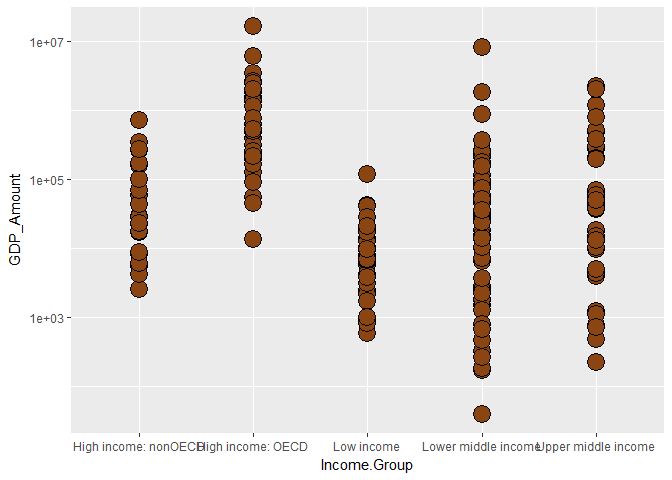

Case Study 1
================
Thangam Sankar
March 11, 2017

I. Introduction
===============

The following is an analysis of the GDP of 190 countries and the impact of income groups on GDP. It uses data sources from WorldBank downloaded from the following links:
-------------------------------------------------------------------------------------------------------------------------------------------------------------------------

-   HTTP Links:

    -   <http://data.worldbank.org/data-catalog/GDP-ranking-table>
    -   <http://data.worldbank.org/data-catalog/ed-stats>

It merges the data from the 2 sources and here are the metrics reported:
------------------------------------------------------------------------

-   Metrics:
    1.  Average GDP rankings for the "High income: OECD" and "High income:nonOECD" groups
    2.  Distribution of GDP value by income group
    3.  Summary statistics of GDP value by income groups
    4.  Count of countries in each income groups grouped according to GDP Ranking quantiles <br> <br> <br>

II. Analysis
============

### This section presents the steps that lead up to the final report and includes the following:

-   Data Import
-   Cleanup
-   Analysis
-   Report <br>

<br> **1. Importing data...**

      i. In the GDP file, skip the first 5 rows which contain general information. 
         The next 190 rows contain GDP information. So import only the next 190 rows
     ii. The EDUstats file does not appear to have any general information. So import all the rows

<br>

**2. Performing Data cleanup...**

-   **Data cleanup involves the following:**

    1.  Giving meaningful names to columns so that it becomes easier to merge the 2 spreadsheets
    2.  Getting count of 'NA' values in the 2 spreadsheets
    3.  Removing empty and 'NA' columns in the 2 spreadsheets
-   **Printing NA Values to get an idea of the number of valid rows that could be used for analysis...**

``` r
print(GDP_NA_Country)
```

    ## [1] 0

``` r
print(GDP_NA_Ranking)
```

    ## [1] 0

``` r
print(GDP_NA_Amount)
```

    ## [1] 0

``` r
print(GDP_NA_Count)
```

    ## [1] 0

``` r
print(EDU_NA_Country)
```

    ## [1] 0

``` r
print(EDU_NA_Income)
```

    ## [1] 0

``` r
print(EDU_NA_Count)
```

    ## [1] 704

#### From the results above, it appears that the GDP spreadsheet has cleaner data than the EDU spreadsheet. However, both the spreadsheets have valid data in the columns that we would be using for analysis namely, Country code, GDP, Income group. So it would not impact our analysis.

<br>

-   **Printing the count of the 2 Datasets after cleanup...**

``` r
nrow(GDP_data)
```

    ## [1] 190

``` r
nrow(EDU_data)
```

    ## [1] 234

#### There are 190 rows in the GDP dataset and 234 rows in the EDUStats dataset after cleanup.

<br>

**3. Performing Analysis of data...**

-   The goal of the analysis is to answer these questions:

    1.  After merging the two data by country short code, how many IDs matched?
    2.  What is the 13th country after ordering the countries in descending order?
    3.  What are the average GDP rankings for "High income: OECD" and "High income:nonOECD"?
        <br>
-   **Printing Number of missing Country Codes...**

``` r
sum(is.na(Merge_GDP_EDU))
```

    ## [1] 454

-   **Printing Number of matched countries...**

``` r
dim(Merge_GDP_EDU)
```

    ## [1] 189  34

#### As can be seen, out of 190 countries in the GDP spreadsheet, 189 matched with the EDUStats spreadsheet which is more than a 99% match.

<br>

-   **Printing the country with the 13th highest GDP.<nbsp> If there is a tie, printing both...**

``` r
print(Merge_GDP_EDU_Sort$CountryName[Merge_GDP_EDU_Sort$rank > 11 & Merge_GDP_EDU_Sort$rank < 13])
```

    ## [1] "Grenada"             "St. Kitts and Nevis"

#### As can be seen, there is a tie between Grenada and St. Kitts and Nevis for the 13th place.

<br>

-   **Printing Average GDP rankings for "High income: OECD" and "High income:nonOECD..."**

``` r
print(Avg_Rank_OECD)
```

    ## [1] 32.96667

``` r
print(Avg_Rank_nonOECD)
```

    ## [1] 91.91304

#### The average GDP rankings for the "High income: OECD" and "High income:nonOECD" groups are 32.96667 and 91.91304 respectively.

<br>

**4. Generating reports...**

-   **Distribution of GDP for all countries by Income Group**



#### The plot above shows the GDP distribution for all countries.

<br>

-   **Summary statistics of GDP by Income Groups**

<!-- -->

    ## $`High income: nonOECD`
    ##    Min. 1st Qu.  Median    Mean 3rd Qu.    Max. 
    ##    2584   12840   28370  104300  131200  711000 
    ## 
    ## $`High income: OECD`
    ##     Min.  1st Qu.   Median     Mean  3rd Qu.     Max. 
    ##    13580   211100   486500  1484000  1480000 16240000 
    ## 
    ## $`Low income`
    ##    Min. 1st Qu.  Median    Mean 3rd Qu.    Max. 
    ##     596    3814    7843   14410   17200  116400 
    ## 
    ## $`Lower middle income`
    ##    Min. 1st Qu.  Median    Mean 3rd Qu.    Max. 
    ##      40    2549   24270  256700   81450 8227000 
    ## 
    ## $`Upper middle income`
    ##    Min. 1st Qu.  Median    Mean 3rd Qu.    Max. 
    ##     228    9613   42940  231800  205800 2253000

<br>

-   **Cut the GDP ranking into 5 separate quantile groups. Make a table of Income Groups across Rank Groups.**

``` r
# Divide Ranking into Quantiles
brk <- quantile(Merge_GDP_EDU_Sort$Ranking, seq(0, 1, 0.2)) 
Merge_GDP_EDU_Quantile <- cut(Merge_GDP_EDU_Sort$Ranking, breaks = brk)
# Make table of Quantile vs. Income group
GDP_EDU_table <- table(Merge_GDP_EDU_Sort$Income.Group, Merge_GDP_EDU_Quantile) 
# Give meaningful names to quantiles
colnames(GDP_EDU_table) <- c("Quantile1", "Quantile2", "Quantile3", "Quantile4", "Quantile5") 
```

-   **Printing Number of countries in Lower middle income but among the 38 nations with highest GDP...**

``` r
print(GDP_EDU_table[4])
```

    ## [1] 5

#### There are 5 countries in the Lower middle income but among the 38 nations with highest GDP.

<br> <br> <br>

III. Conclusion:
================

The following conclusions could be drawn:
-----------------------------------------

-   From the results of cleanup, it appears that the quality of the data is good. There is an almost 100% match between the 2 spreadsheets. So we can come to reasonable conclusions with this data.
-   As seen in the response to Question 3 under analysis, the average GDP ranking for "High income: OECD" is less than the average GDP ranking for "High income: nonOECD" groups.
-   The plot in reports shows that the GDP for the lower middle income countries is highly varied and extends from low to high GDPs, whereas the GDP for the high income OECD and nonOECD groups is very close to all groups.
-   There are some countries(5) which despite being in the Lower middle income group are among the nations with highest GDP
-   The data are all observational data with no causal interpretation
