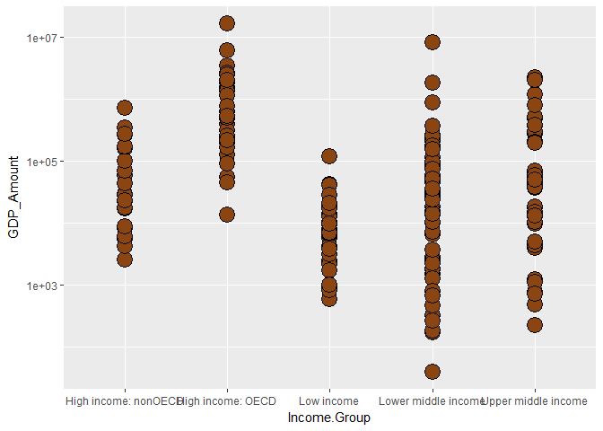

Case Study 1
================
Thangam Sankar
March 11, 2017

I. Introduction
===============

The following is an analysis of the GDP of 190 countries and the impact of income groups on GDP. It uses data sources from WorldBank downloaded from the following links:
-------------------------------------------------------------------------------------------------------------------------------------------------------------------------

-   HTTP Links:

    -   <http://data.worldbank.org/data-catalog/GDP-ranking-table>
    -   <http://data.worldbank.org/data-catalog/ed-stats>

It merges the data from the 2 sources and here are the metrics reported:
------------------------------------------------------------------------

-   Metrics:
    1.  Average GDP rankings for the "High income: OECD" and "High income:nonOECD" groups
    2.  Distribution of GDP value by income group
    3.  Summary statistics of GDP value by income groups
    4.  Count of countries in each income groups grouped according to GDP Ranking quantiles <br>

II. Analysis
============

<br> **1. Import data...**

<br> **2. Performing Data cleanup...**

-   **Printing NA Values**

``` r
print(GDP_NA_Country)
```

    ## [1] 0

``` r
print(GDP_NA_Ranking)
```

    ## [1] 0

``` r
print(GDP_NA_Amount)
```

    ## [1] 0

``` r
print(GDP_NA_Count)
```

    ## [1] 0

``` r
print(EDU_NA_Country)
```

    ## [1] 0

``` r
print(EDU_NA_Income)
```

    ## [1] 0

``` r
print(EDU_NA_Count)
```

    ## [1] 704

-   **Count of GDP Data after cleanup**

``` r
nrow(GDP_data)
```

    ## [1] 190

<br> **3. Analysis of data**

-   Analysis Steps:

    1.  After merging the two data by country short code, how many IDs matched?
    2.  What is the 13th country after ordering the countries in descending order?
    3.  What are the average GDP rankings for "High income: OECD" and "High income:nonOECD"?
        <br>
-   **Number of matching Country Codes**

``` r
sum(is.na(Merge_GDP_EDU))
```

    ## [1] 454

<br>

-   **13th country. There is a tie between Grenada and St. Kitts and Nevis. So print both.**

``` r
print(Merge_GDP_EDU_Sort$CountryName[Merge_GDP_EDU_Sort$rank > 11 & Merge_GDP_EDU_Sort$rank < 13])
```

    ## [1] "Grenada"             "St. Kitts and Nevis"

<br>

-   **Average GDP rankings for "High income: OECD" and "High income:nonOECD"**

``` r
print(Avg_Rank_OECD)
```

    ## [1] 32.96667

``` r
print(Avg_Rank_nonOECD)
```

    ## [1] 91.91304

<br>

**4. Generating reports...**

-   **Distribution of GDP for all countries by Income Group**

 <br>

-   **Summary statistics of GDP by Income Groups**

<!-- -->

    ## $`High income: nonOECD`
    ##    Min. 1st Qu.  Median    Mean 3rd Qu.    Max. 
    ##    2584   12840   28370  104300  131200  711000 
    ## 
    ## $`High income: OECD`
    ##     Min.  1st Qu.   Median     Mean  3rd Qu.     Max. 
    ##    13580   211100   486500  1484000  1480000 16240000 
    ## 
    ## $`Low income`
    ##    Min. 1st Qu.  Median    Mean 3rd Qu.    Max. 
    ##     596    3814    7843   14410   17200  116400 
    ## 
    ## $`Lower middle income`
    ##    Min. 1st Qu.  Median    Mean 3rd Qu.    Max. 
    ##      40    2549   24270  256700   81450 8227000 
    ## 
    ## $`Upper middle income`
    ##    Min. 1st Qu.  Median    Mean 3rd Qu.    Max. 
    ##     228    9613   42940  231800  205800 2253000

<br>

-   **Number of countries in Lower middle income but among the 38 nations with highest GDP**

``` r
print(GDP_EDU_table[4])
```

    ## [1] 5

<br>

III. Conclusion:
================

The following conclusions could be drawn:
-----------------------------------------

-   As seen in the response to Question 3 under analysis, the average GDP ranking for "High income: OECD" is less than the average GDP ranking for "High income: nonOECD" groups
-   The plot in reports shows that the GDP for the lower middle income countries is highly varied extends from low to high GDPs, whereas the GDP for the high income OECD and nonOECD groups is very close to all groups.
-   There are some countries(5) which despite being in the Lower middle income group are among the nations with highest GDP
-   The data are all observational data with no causal interpretation
